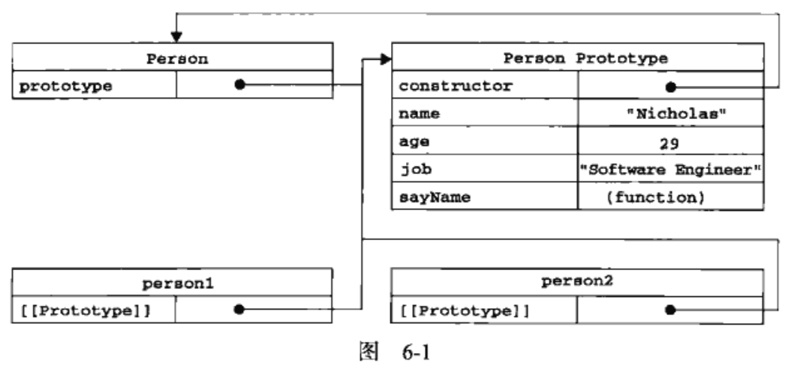

## 面向对象
1. 对象是一组无序的属性的集合，属性可以包含基本值，对象，或函数
2. 对象是一组键值对，值可以是数据，或函数
3. 属性类型有两种：
    - 数据属性：包含一个数据值的位置，在这个位置可以读取和写入
        - \[Configurable\]表示能否通过delete删除属性，从而重新定义属性，能否修改属性特性，或者能否修改为访问器属性，默认值是true
        - \[Enumerable\]表示能否通过for-in循环返回属性，默认值true
        - \[Writable\]表示能否修改属性的值，默认值true
        - \[Value\]读取这个属性的时候，从这个位置读取，默认值undefined
        - 要修改属性默认的特性，必须使用Object.defineProperty()
        - 方法接收三个参数，1: 属性所在的对象， 2: 属性名， 3: 描述符对象
        - 描述符属性必须是configurable，enumerable，writable，value
        - 在调用Object.defineProperty()方法时不指定这些属性，默认值都为false
    - 访问器属性：不包含数据值，他们包含一对getter（读取），setter（写入）函数，不过不是必须的
        - 访问器属性有如下4个特性
            - \[Configurable\]：同数据属性
            - \[Enumerable\]：同数据属性
            - \[Get\]：读取时调用的函数，默认值undefined
            - \[Set\]：写入时调用的函数，默认值undefined
            - 访问器属性，必须通过Object.defineProperty()方法来定义
        - 定义多个属性：Object.defineProperties()方法
            - 接收两个对象参数： 1: 要添加或修改的目标对象，2: 第二个是定义，修改对象的内容
    - 读取属性的特性： Object.definePropertyDescriptor()
        - 接收两个参数：1: 属性所在的对象，2: 要读取描述符，的属性，的名称
4. 工厂模式：设计模式之一
    ```
    function createPerson(name, age, job) {
        var o = new Object()
        o.name = name
        o.age = age
        o.job = job
        o.sayName = function() {
            alert(this.name)
        }
        return o
    }
    var person1 = createPerson("ben", 27, "software engineer")
    var person2 = createPerson("benjamin", 18, "CEO")
    ```
5. 构造函数模式： 设计模式之一
    ```
    function Person(name, age, job) {
        this.name = name
        this.age = age
        this.job = job
        this.sayName = function() {
            alert(this.name)
        }
    }
    var person1 = new Person("ben", 27, "software engineer")
    var person2 = new Person("benjamin", 18, "CEO")
    ```
    - 比较：
        - 没有显式的创建对象
        - 直接将属性和方法赋值给了this对象
        - 没有return语句
        - 函数名首字母大写
        - 必须使用new操作符， 实际上经历了4个步骤
            - 创建一个新对象
            - 将构造函数的作用域赋值给新对象
            - 执行构造函数中的代码
            - 返回新对象
        - person1，2都有constructor属性，指向构造函数Person
        - 通过创建自定义的构造函数，意味着可以将它的实例定义为一种特定的类型，这正是构造函数模式，胜过工厂模式的地方
        - 构造函数也是函数，如果不是用new关键字调用，那么它就是普通函数
        - 通过new 关键字调用，都是构造函数
    - 构造函数的问题：
        - 每个方法，都要在实例上创建一遍，改写如下
            ```
            function Person(name, age, job) {
                this.name = name
                this.age = age
                this.job = job
                this.sayName = sayName
            }
            // 单独放在外面，避免了函数每次创建，但是丝毫无封装性可言
            function sayName() {
                alert(this.name)
            }
            var person1 = new Person("ben", 27, "software engineer")
            var person2 = new Person("benjamin", 18, "CEO")
            ```
6. 原型模式：设计模式之一
    - 每一个函数都有prototype这个属性，这个属性是一个指针，指向一个对象
    - 这样做的好处：不必在构造函数中定义实例的信息，而是把这些信息直接添加到原型对象中
        ```
        function Person() {}
        Person.prototype.name = "benjamin"
        Person.prototype.age = 27
        Person.prototype.job = "software engineer"
        Person.prototype.sayName = functoin() {
            alert(this.name)
        }
        var person1 = new Person()
        person1.sayName() // "benjamin"
        var person2 = new Person()
        person2.sayName() // "benjamin"
        person1.sayName == person2.sayName // true
        ```
7. 理解原型对象
    - 无论何时，只要创建了一个新的对对象，就会根据特定的规则为函数创建一个prototype属性，这个属性指向函数的原型对象
    - 所有原型对象都会自动获得一个constructor属性，这个属性包含一个指向prototype属性所在函数的指针
    
